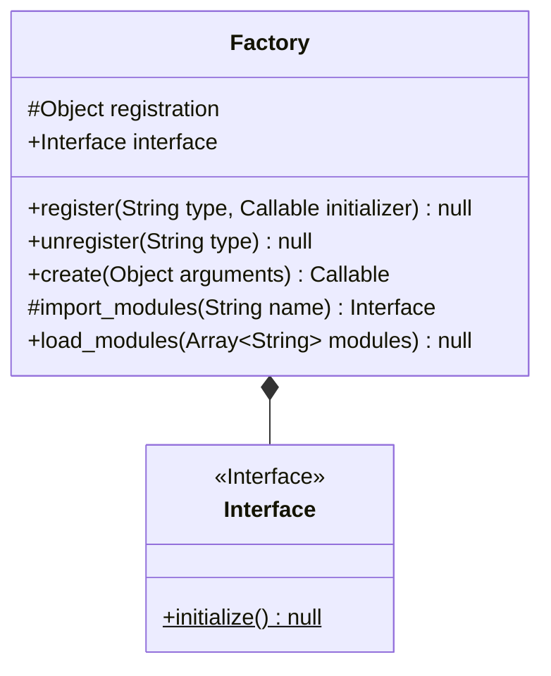

# Utilities

### Factory

This utility is used when the factory pattern is used. There are functions to map initializers to strings; therefore seperating creation from use.

Diagrams:

```mermaid
classDiagram
    class Factory {
        #Object registration
        +Interface interface
        +register(String type, Callable initializer) null
        +unregister(String type) null
        +create(Object arguments) Callable
        #import_modules(String name) Interface
        +load_modules(Array~String~ modules) null
    }
    class Interface {
        <<Interface>>
        +initialize()$ null
    }
    Factory *-- Interface
```