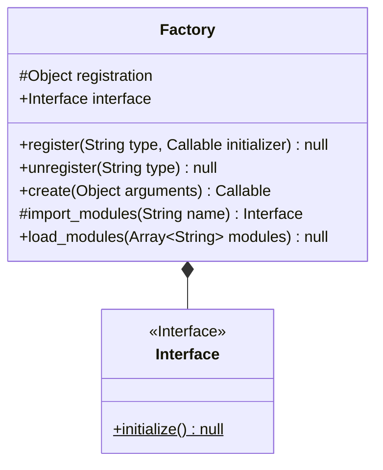
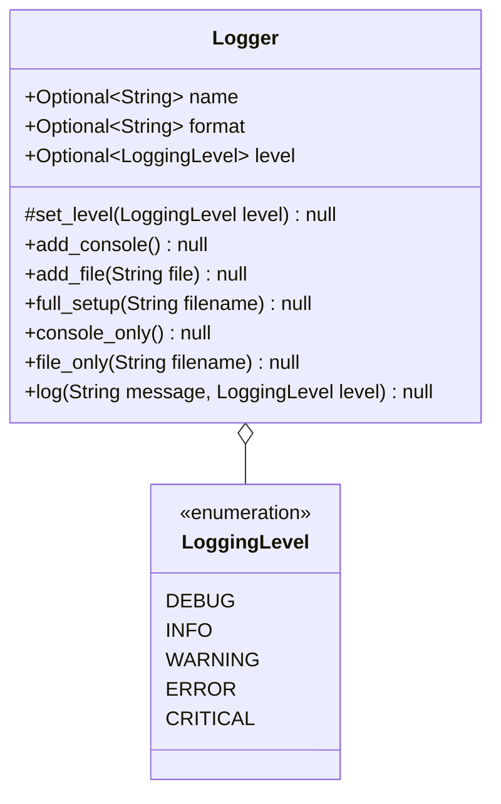

# Utilities

## Table of Contents

1. [Files](#files)
    1. [File](#file)
    2. [Preprocess](#preprocess)
2. [Funcs](#funcs)
    1. [Asynchronous](#asynchronous)
    2. [Compose](#compose)
3. [Patterns](#patterns)
    1. [Event](#event)
    2. [Factory](#factory)
        1. [Diagrams](#factory-implementation)
4. [Globals](#globals)
    1. [Aliases](#aliases)
    2. [Log](#log)
        1. [Diagrams](#logger-implementation)

### Files

---

A package that deals with operations performed on files; such as comparing, zipping, or preprocessing.

#### __File__

A module that has three functions. One to zip a file, one to extract a file, and another to compare two text files.

#### __Preprocess__

At the moment all this module does is converts a cammel case: `someFunctionOrVariable` to snake case &mdash; the default in python &mdash; : `some_function_or_variable`. This problem primarily comes from analyzing the StackOverflow Developers Survey.

---

### Funcs

#### __Asynchronous__

As the name implies, this is a module that deals with the asynchronous operations of functions.

#### __Compose__

Again, as the name suggest, this module deals with function and string composition.

---

### Patterns

A package that aids with the boilerplate associated with most design patterns, such as the event or abstract-factory pattern. 

#### __Event__

A module that contains two functions. One to subscribe to a specific event, and the other to post an event when it occures. Each event is stored in a dictionary. This utility ONLY DEALS WITH THE CREATING, AND POSTING THE EVENTS; this module does not include a way to implement or activate the controlling mechanism in the design pattern. A simple way to implement the design pattern involves functions that setup handlers to each event. The example I will use in this instance is a logging handler from my Login software using the [Logger](#log) defined in this code base.

Example:

```python
"""
When two things are happing at once in a function, it is an indicator of low cohesion; high coupling; overall bad design; and an indicator that the event pattern should be used.
"""
import utils
import system # system found in the example code base
import i18n # internationalization library

# individual functions to handle what happens during each event
def handle_application_start(ui: str, logger: utils.Logger) -> None:
    logger.log(i18n.t("general.logs.application_start", ui_name=ui.upper()))

def handle_user_registered_event(user: system.User, logger: utils.Logger) -> None:
    logger.log(i18n.t("general.logs.user_registered", name=user.name), utils.LoggingLevel.INFO)

def handle_user_logged_in_event(user: system.User, logger: utils.Logger) -> None:
    logger.log(i18n.t("general.logs.user_login", name=user.name), utils.LoggingLevel.INFO)

def handle_user_password_forgotten_event(user: system.User, logger: utils.Logger) -> None:
    logger.log(i18n.t("general.logs.reset_password", name=user.name), utils.LoggingLevel.INFO)

def handle_user_upgrade_plan_event(name: str, plan: str, logger: utils.Logger) -> None:
    logger.log(i18n.t("general.logs.upgrade_plan", name=name, plan=plan), utils.LoggingLevel.INFO)

def handle_application_end(logger: utils.Logger) -> None:
    logger.log(i18n.t("general.logs.application_end"))

# one function to run each of the individual function
def setup_log_event_handlers(logger: utils.Logger):
    utils.subscribe("application_start", lambda ui: handle_application_start(ui, logger))
    utils.subscribe("user_registered", lambda user: handle_user_registered_event(user, logger))
    utils.subscribe("user_logged_in", lambda user: handle_user_logged_in_event(user, logger))
    utils.subscribe("user_password_forgotten", lambda user: handle_user_password_forgotten_event(user, logger))
    utils.subscribe("user_upgrade_plan", lambda args: handle_user_upgrade_plan_event(*args, logger=logger))
    utils.subscribe("application_end", lambda _: handle_application_end(logger))
```

#### __Factory__

This module essentialy is a mapping of strings to initializers. The way it seperates creation from use is by storing the instance in a dictionary under the name given in the register function (see [diagrams](#diagrams) below) which is called using the create function. This delegates the create to one function and the use to the programme implementing the utility.

#### Factory Implementation:



---

### Globals

#### __Aliases__

This module tackles the problem of type aliases, and where to store them. This module takes the job of defining types aliases out of the source code, and instead puts it in a global file dedicated to the job of defining type aliases.

#### __Log__

A logger. That's it. View the [diagrams](#logger-implementation)

#### Logger Implementation:

