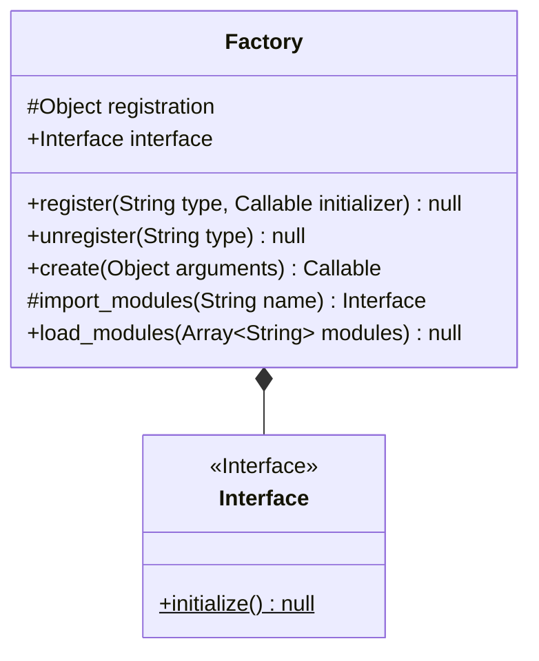

# Utilities
 
## Table of Contents

1. [Display](#display)
2. [Database](#database)
3. [Event](#event)
4. [Factory](#factory)

### Display

This module contains utilities that aid in the display of a programme.

### Database

This module contains utilities that aid in the creation and reading of data in a database.

### Event

This module contains utilities that aid in the usage of the event design pattern.

### Factory

This utility is used when the factory pattern is used. There are functions to map initializers to strings; therefore seperating creation from use.

Diagrams:

