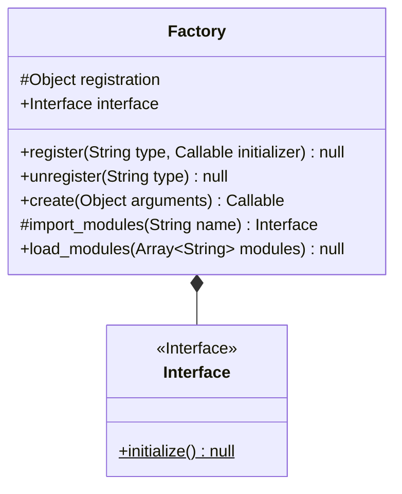

# Utilities
 
## Table of Contents

1. [Async](#async)
2. [Compose](#compose)
3. [Database](#database)
4. [Display](#display)
5. [Event](#event)
6. [Factory](#factory)
7. [Files](#files)
8. [Log](#log)
9. [Preprocess](#preprocess)
10. [Types](#types)

### Async

### Compose

### Database

This module contains utilities that aid in the creation and reading of data in a database.

### Display

This module contains utilities that aid in the display of a programme.

### Event

This module contains utilities that aid in the usage of the event design pattern.

### Factory

This utility is used when the factory pattern is used. There are functions to map initializers to strings; therefore seperating creation from use.

Diagrams:

### Files

This module contains functions to help in dealing with files.

### Log

This is a wrapper class over the logging module.

### Preprocess

This module contains functions to help with the preprocessing of data.

### Types

This is a collection of type aliases.