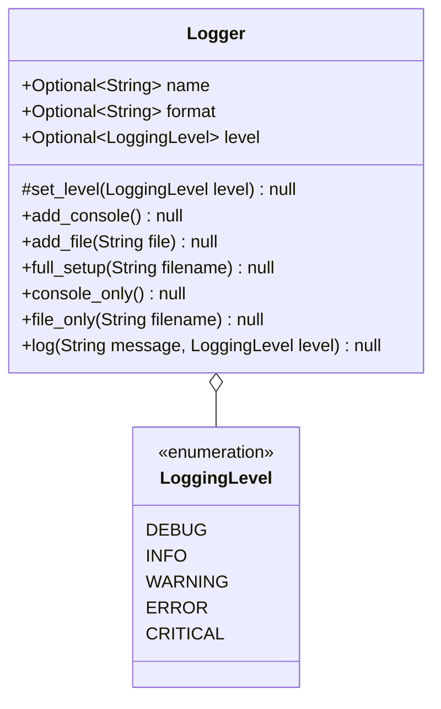

# Utilities

## Table of Contents

1. [Files](/docs/en-UK/files/README.md)
2. [Funcs](/docs/en-UK/funcs/README.md)
3. [Patterns](/docs/en-UK/patterns/README.md)
4. [Globals](#globals)
    1. [Aliases](#aliases)
    2. [Log](#log)
        1. [Diagrams](#logger-implementation)

---

### Globals

#### __Aliases__

This module tackles the problem of type aliases, and where to store them. This module takes the job of defining types aliases out of the source code, and instead puts it in a global file dedicated to the job of defining type aliases.

#### __Log__

A logger. That's it. View the [diagrams](#logger-implementation)

#### Logger Implementation:

