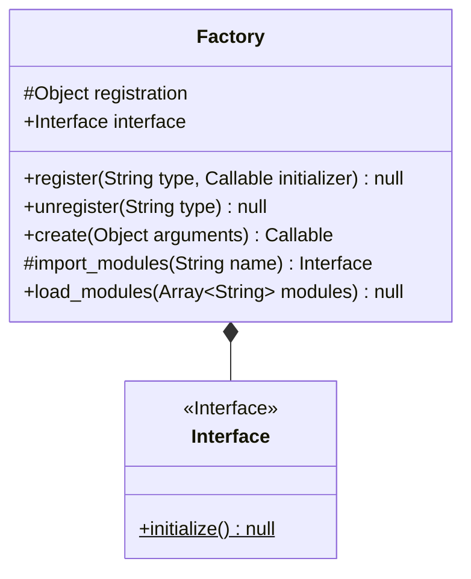
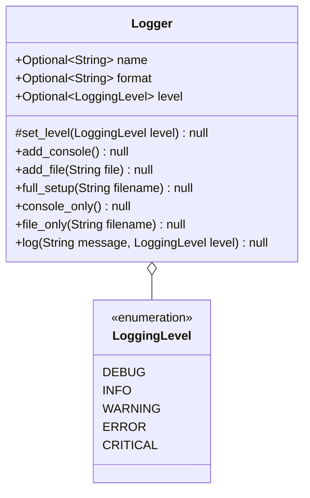

# Utilities

## Table of Contents

1. [Files](/docs/en-UK/files/README.md)
2. [Funcs](/docs/en-UK/funcs/README.md)
3. [Patterns](#patterns)
    1. [Event](/docs/en-UK/patterns/event/README.md)
    2. [Factory](#factory)
        1. [Diagrams](#factory-implementation)
4. [Globals](#globals)
    1. [Aliases](#aliases)
    2. [Log](#log)
        1. [Diagrams](#logger-implementation)

### Patterns

A package that aids with the boilerplate associated with most design patterns, such as the event or abstract-factory pattern.

#### __Factory__

This module essentialy is a mapping of strings to initializers. The way it seperates creation from use is by storing the instance in a dictionary under the name given in the register function (see [diagrams](#diagrams) below) which is called using the create function. This delegates the create to one function and the use to the programme implementing the utility.

#### Factory Implementation:

---

### Globals

#### __Aliases__

This module tackles the problem of type aliases, and where to store them. This module takes the job of defining types aliases out of the source code, and instead puts it in a global file dedicated to the job of defining type aliases.

#### __Log__

A logger. That's it. View the [diagrams](#logger-implementation)

#### Logger Implementation:

