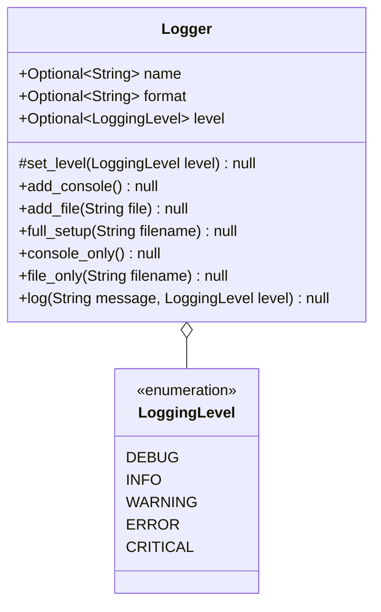

# Globals

## Table of Contents
1. [Aliases](/docs/en-UK/globals/aliases/README.md)
2. [Log](#log)

## Log

A logger. That's it. View the [diagrams](#logger-implementation)

### Logger Implementation:

