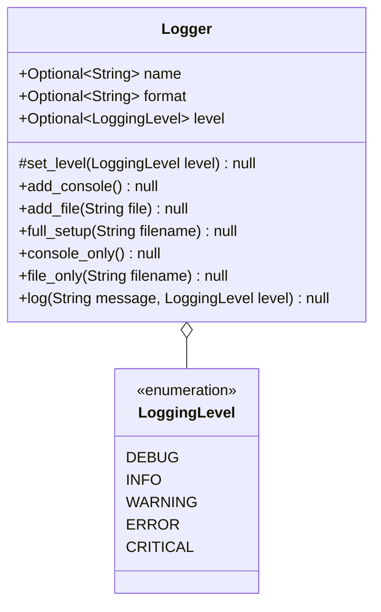

# Log

A wrapper around the built-in python logging package. This module solves the problem of the original logging package not having a simple API for dealing with both dynamic logging and complex logging. The dynamic logging problem arises when you have to use the functions `logging.info(...)`, `logging.error(...)`, etc. To make this mechanism more generic, I would have to implement some form of factory; mapping strings to callable functions as an example. This provides an easy to use object that can dynamically log and handle complex logging. For a class diagram, you can view the provided [diagrams](#implementation) below.

## Implementation:

