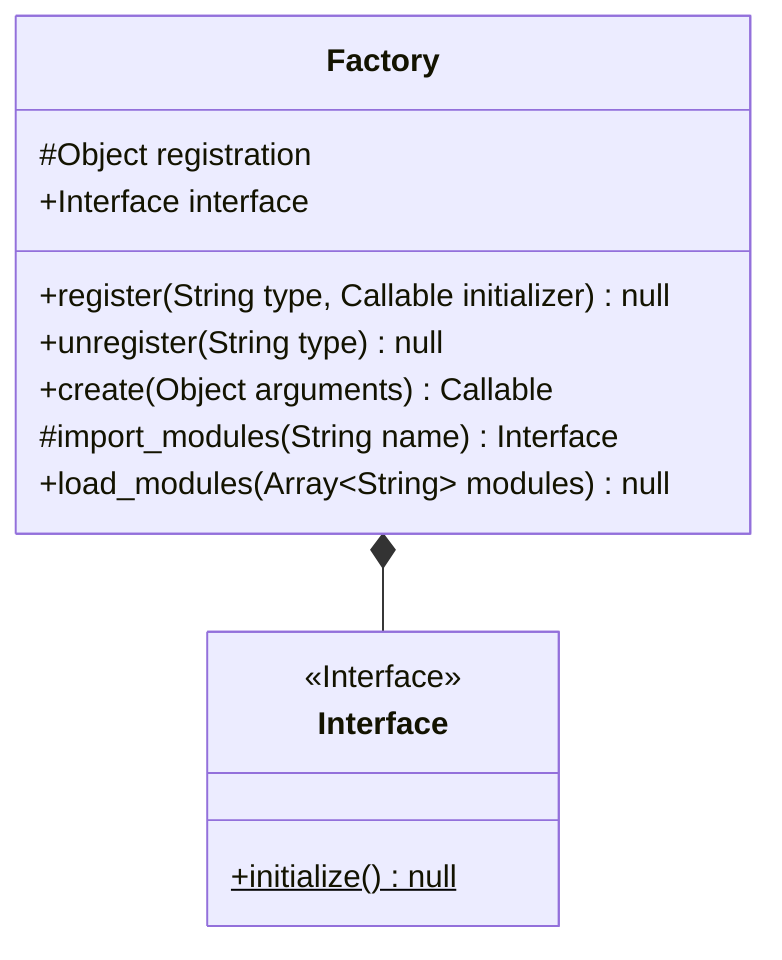

# Factory

This module essentialy is a mapping of strings to initializers. The way it seperates creation from use is by storing the instance in a dictionary under the name given in the register function (see the [diagrams](#implementation) below) which is called using the create function. This delegates the create to one function and the use to the programme implementing the utility.

## Implementation:

